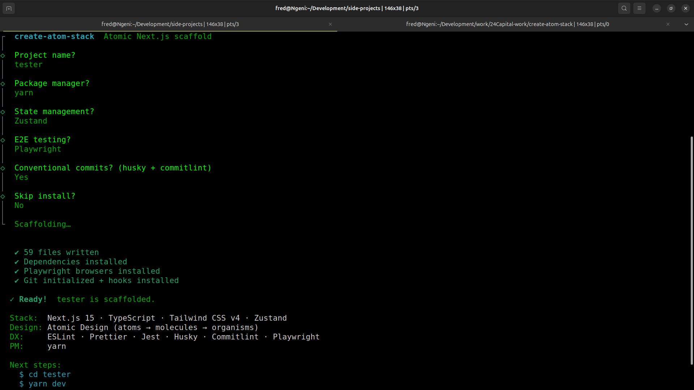

# create-atom-stack

**create-atom-stack** is a CLI that does two things: scaffolds a production-ready [Next.js 15](https://nextjs.org) project with atomic design, Zustand, Tailwind CSS v4, and Conventional Commits — and keeps generating for you after scaffold with a full suite of `add` generators (components, pages, features, stores, API modules).

No boilerplate hunting. No config copy-pasting. Just run and build.

[](https://www.npmjs.com/package/create-atom-stack)
[](https://www.npmjs.com/package/create-atom-stack)
[](https://github.com/hakizimana-fred/create-atom-stack/blob/main/LICENSE)

**Links:** [NPM Package](https://www.npmjs.com/package/create-atom-stack) · [GitHub Repository](https://github.com/hakizimana-fred/create-atom-stack)

---



---

## Quick Start

Three ways to scaffold — pick what fits your workflow:

**Fully interactive** — three questions: name → package manager → "use recommended defaults?":

```bash
npx create-atom-stack
```

**Zero-config** — pass a name and get a project in seconds using smart defaults (npm · Zustand · no E2E):

```bash
npx create-atom-stack my-app
```

**Explicit flags** — non-interactive with full control, great for scripts and CI:

```bash
npx create-atom-stack my-app --pm=pnpm --state=react-query --e2e=playwright
```

Then start developing:

```bash
cd my-app
pnpm dev   # or: npm run dev / yarn dev / bun dev
```

---

## Scaffold Options

| Flag | Default | Description |
|---|---|---|
| `--pm=<npm\|pnpm\|yarn\|bun>` | `npm` | Package manager |
| `--state=<zustand\|jotai\|react-query\|none>` | `zustand` | State management library |
| `--e2e=<playwright\|cypress\|none>` | `none` | End-to-end testing framework |
| `--rxjs` | — | Add RxJS (Observable streams + `useObservable` hook) |
| `--xstate` | — | Add XState (state machines + `useMachine` integration) |
| `--no-conventional-commits` | — | Skip Husky + Commitlint setup |
| `--no-git` | — | Skip `git init` |
| `--skip-install` | — | Scaffold files only, skip dependency install |

---

## What You Get

Generated project structure:

```
<project>/
├── src/
│   ├── app/                              # Next.js App Router
│   │   ├── globals.css                   # CSS design tokens (light + dark)
│   │   ├── layout.tsx                    # Root layout with Geist fonts
│   │   ├── page.tsx                      # Futuristic dark landing page
│   │   └── docs/page.tsx                 # Design system docs page
│   │
│   ├── components/                       # Atomic Design System
│   │   ├── atoms/                        # Badge, Button, Card, Input, Loading, Typography
│   │   ├── molecules/                    # CodeBlock, FeatureCard, Pagination
│   │   └── organisms/                    # Header, Footer
│   │
│   ├── store/
│   │   └── ui.store.ts                   # Zustand: theme + sidebar state
│   ├── lib/
│   │   ├── http/                         # Typed HTTP client (get/post/put/patch/delete)
│   │   │   ├── client.ts                 # Fetch wrapper, AbortController timeout
│   │   │   ├── interceptors.ts           # Request/response interceptors, auth token
│   │   │   ├── errors.ts                 # ApiError class + guards
│   │   │   ├── types.ts                  # QueryParams, RequestOptions, interceptor types
│   │   │   └── index.ts                  # Clean public surface
│   │   └── utils/                        # cn(), formatters
│   ├── hooks/
│   │   └── use-scroll-state.ts
│   ├── types/                            # AsyncState, PaginatedResponse, etc.
│   ├── data/constants/                   # Navigation config
│   └── design-system/tokens/             # JS mirrors of CSS tokens (colors, spacing, etc.)
│
├── tailwind.config.ts                    # Token-driven Tailwind config
├── .husky/                               # pre-commit lint + commit-msg lint
├── .vscode/                              # settings.json, launch.json, extensions.json
├── commitlint.config.ts                  # Conventional Commits rules
├── .releaserc                            # Semantic-release config
├── .nvmrc                                # Node version pin
├── ARCHITECTURE.md                       # Project structure guide
└── docs/                                 # Design system + getting started docs
```

---

## `add` Generators

After scaffolding, use `create-atom-stack add` to keep generating inside your project:

```bash
npx create-atom-stack add <type> <name> [options]
```

Run without arguments for an interactive type + name prompt:

```bash
npx create-atom-stack add
```

### Generator types

**Atomic Design**

| Type | Output directory | Description |
|---|---|---|
| `atom` | `src/components/atoms/` | Smallest reusable UI unit |
| `molecule` | `src/components/molecules/` | Composed of atoms |
| `organism` | `src/components/organisms/` | Self-contained section |
| `template` | `src/components/templates/` | Page layout / structural shell |
| `component` | `src/components/` | Generic — not tied to atomic level |

**App-level**

| Type | Output directory | Description |
|---|---|---|
| `page` | `src/app/` | Next.js App Router page |
| `feature` | `src/features/` | Feature-first module directory |
| `store` | `src/store/` | State store — auto-detects Zustand / RTK / Jotai / MobX |
| `api` | `src/api/` | API module + types + Zod schemas |

### Component flags

Applies to `atom`, `molecule`, `organism`, `template`, `component`:

```bash
npx create-atom-stack add atom Button --variants      # variant prop + data-variant attr
npx create-atom-stack add atom Button --with-test     # generates .test.tsx
npx create-atom-stack add atom Button --with-styles   # generates .styles.ts
npx create-atom-stack add atom Button --with-story    # generates .stories.tsx
```

### Feature flags

```bash
npx create-atom-stack add feature billing                          # minimal — index.ts only
npx create-atom-stack add feature billing --with=components,hooks  # add subdirs
# Valid subdirs: components, hooks, services, store, utils, types
```

### API flags

The `api` generator auto-detects Zod. When Zod is present, `schemas.ts` becomes the single source of truth (inferred types, no separate `.types.ts`).

```bash
npx create-atom-stack add api users           # interactive mode prompt
npx create-atom-stack add api users --crud    # list · get · create · update · remove (default)
npx create-atom-stack add api users --query   # list · get (read-only)
npx create-atom-stack add api payments --action  # single mutation (execute)
npx create-atom-stack add api payments --custom  # empty shell
```

### General options

| Flag | Description |
|---|---|
| `--dry` | Preview what would be generated without writing any files |
| `--force` | Overwrite existing files without prompting |
| `--dir=<path>` | Override the default output directory |
| `--name=<value>` | Pass the name as a flag (avoids zsh glob issues with dynamic routes) |

### Dynamic route segments

Brackets in route names (`[id]`, `[slug]`) are glob characters in zsh/bash — always quote them or use `--name=`:

```bash
npx create-atom-stack add page "dashboard/[id]"
# or
npx create-atom-stack add page --name="dashboard/[id]"
```

### More examples

```bash
npx create-atom-stack add atom Button --variants --with-test
npx create-atom-stack add molecule SearchBar --with-story
npx create-atom-stack add organism Navbar
npx create-atom-stack add template DashboardLayout
npx create-atom-stack add page dashboard/reports
npx create-atom-stack add store auth           # auto-detects and installs the right SM package
npx create-atom-stack add api users --crud
```

---

## Creating a Custom Generator

The generator system is built around three small interfaces. You can add any new type in four steps.

### 1. Understand the interfaces

```ts
// src/types/generator.ts

interface GeneratorContext {
  rawName:    string;   // name as typed by the user, e.g. "auth/[id]"
  pascalName: string;   // PascalCase of the last segment, e.g. "Id"
  camelName:  string;   // camelCase, e.g. "id"
  kebabName:  string;   // kebab-case, e.g. "id"
  outDir:     string;   // absolute output directory
  dry:        boolean;  // true = preview only, don't write
  force:      boolean;  // true = overwrite existing files
  extra?:     Record<string, unknown>;  // any flags passed via --flag or interactive prompts
}

interface GeneratedFile {
  fullPath:     string;  // absolute path where the file will be written
  relativePath: string;  // shown to the user in the output
  content:      string;  // file content
}

interface Generator {
  type:           GeneratorType;  // must match the key you register
  defaultBaseDir: string;         // relative to cwd, e.g. "src/hooks"
  generate(ctx: GeneratorContext): GeneratedFile[] | Promise<GeneratedFile[]>;
}
```

### 2. Create the generator file

Add `src/generators/hook/index.ts`:

```ts
import path from 'path';
import type { Generator, GeneratorContext, GeneratedFile } from '../../types/generator.js';

const hookGenerator: Generator = {
  type: 'hook' as any,          // cast until you add it to the GeneratorType union
  defaultBaseDir: 'src/hooks',

  generate(ctx: GeneratorContext): GeneratedFile[] {
    const { pascalName, camelName, outDir } = ctx;
    const cwd = process.cwd();

    const files: Array<[string, string]> = [
      [
        `use${pascalName}.ts`,
        `import { useState } from 'react';

export function use${pascalName}() {
  const [state, setState] = useState(null);
  return { state, setState };
}
`,
      ],
    ];

    return files.map(([name, content]) => {
      const fullPath = path.join(outDir, name);
      return { fullPath, relativePath: path.relative(cwd, fullPath), content };
    });
  },
};

export default hookGenerator;
```

### 3. Register it

Open `src/generators/registry.ts` and add two lines:

```ts
import hookGenerator from './hook/index.js';   // add import

const REGISTRY = new Map<GeneratorType, Generator>([
  // ... existing entries ...
  ['hook', hookGenerator],                      // add entry
]);
```

### 4. Add it to the type union

Open `src/types/generator.ts` and extend `GeneratorType`:

```ts
export type GeneratorType =
  | 'component'
  | 'atom'
  | 'molecule'
  | 'organism'
  | 'template'
  | 'page'
  | 'feature'
  | 'store'
  | 'api'
  | 'hook';   // ← your new type
```

After `npm run build`, your generator is live:

```bash
node dist/index.js add hook useWindowSize
# or after publishing:
npx create-atom-stack add hook useWindowSize
```

### Tips

- **`ctx.extra`** holds any flags you parse in `src/commands/add.ts` (e.g. `--with-test` sets `extra.withTest`). Read from it to make your generator flag-aware.
- **`generate` can be `async`** — the store generator uses this to detect and install the right state management package before writing files.
- **Dry run is free** — the `writeGeneratedFiles` utility in `src/utils/file-utils.ts` already respects `ctx.dry` and `ctx.force`. Your `generate()` function only needs to return files; it never writes them directly.
- **Templates belong in `src/generator-templates/`** — keep template strings out of the generator index file. See `src/generator-templates/atomic.ts` for a clean example.

---

## Tech Stack

| Category | Choice |
|---|---|
| Framework | Next.js 15 App Router |
| Language | TypeScript 5 (strict) |
| Styling | Tailwind CSS v4 |
| State | Zustand v5 (or Jotai / TanStack Query / none) |
| Icons | Lucide React |
| HTTP | Custom typed fetch client (`src/lib/http/`) |
| Fonts | Geist Sans + Geist Mono |
| Toasts | Sonner |
| Git Hooks | Husky + Commitlint |
| Testing | Jest + Testing Library |
| Formatting | Prettier |
| Linting | ESLint 9 |
| Releases | Semantic Release |

---

## Design System

The design system is **token-driven**: all design decisions live as CSS custom properties in `globals.css` and are mapped to Tailwind utilities via `tailwind.config.ts`.

Theme switching is controlled by `data-theme="dark"` on `<html>` — no `dark:` class variants needed.

**Key color groups:**

- `--glass-*` — Frosted glass surfaces
- `--surface-*` — Solid backgrounds
- `--text-*` / `txt-*` utilities — Text hierarchy
- `--brand-*` — Primary interactive color
- `--profit` / `--loss` / `--warning` — Status colors

---

## Contributing / Local Development

```bash
# Clone and install
git clone https://github.com/hakizimana-fred/create-atom-stack.git
cd create-atom-stack
npm install

# Build the CLI
npm run build

# Watch mode (rebuild on change)
npm run dev

# Test locally without publishing
node dist/index.js my-test-app --skip-install

# Test the add generators
node dist/index.js add atom Button --dry
```

---

## Publishing

```bash
npm publish
```

After publishing, users can scaffold a new project with:

```bash
npx create-atom-stack my-app
# or
pnpm dlx create-atom-stack my-app
# or
bunx create-atom-stack my-app
```

---

## Keywords

`create-atom-stack` · `create atom stack` · CLI tool · project scaffolding · Next.js starter · JavaScript starter · TypeScript boilerplate · atomic design · React scaffold · frontend starter kit · code generator · component generator
